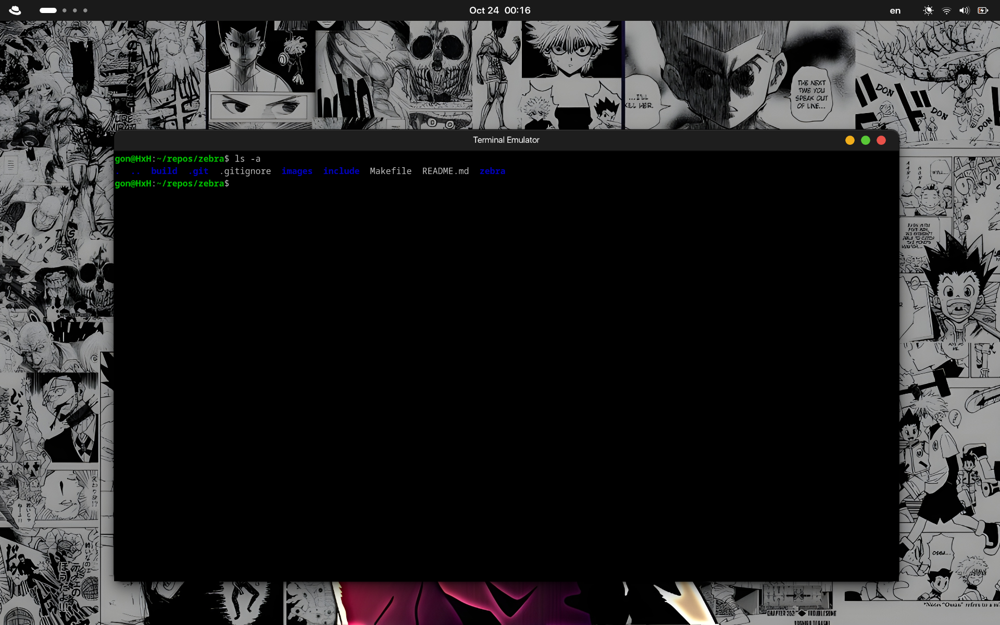

# Zebra Emulator GUI

Zebra is a lightweight GTK-based graphical emulator  written in C. It uses **GTK+ 3** and **VTE 2.91**.




## Project Structure

```
.
├── build/              # Compiled binaries
│   ├── ide
│   └── zebra           # Final executable will be placed here
├── include/            # Header files
│   ├── debug.h
│   ├── emulator.h
│   └── pty.h
├── Makefile
└── zebra/              # Source files
    ├── debug.c
    ├── emulator.c
    ├── main.c          # Entry point
    └── pty.c
```


## Features

* GTK+ 3 graphical interface
* VTE terminal widget integration
* PTY (pseudo-terminal) handling
* Modular design (debugging, emulation, terminal handling)
* Simple and minimal build system


## Dependencies

This project requires the following packages:

* **GTK+ 3 development libraries** (`gtk3-devel`)
* **VTE terminal emulator library** (`vte291-devel`)
* Standard GNU build tools (`gcc`, `make`, pkg-config`)

You can install everything using the provided Makefile target:

```sh
make dependencies
```

> The Makefile uses the Fedora package manager (`dnf`). If you're on another distribution, install the equivalent GTK3 and VTE packages.


## Building the Project

Simply run:

```sh
make
```

This will compile all source files inside the `zebra/` directory and place the output binary at:

```
build/zebra
```


## Running the Application

After building, run:

```sh
make run
```

## Cleaning Build Artifacts

To remove the compiled binary:

```sh
make clean
```

### Build rule:

The Makefile compiles all `.c` files:

```
$(CC) $(CFLAGS) -o build/zebra zebra/* $(LDFLAGS)
```

## License

This project is licensed under the GNU General Public License v3.0 (GPL-3.0).